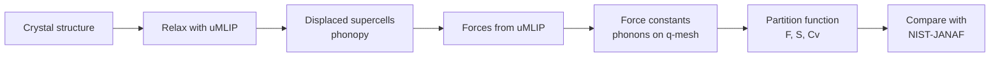

# forces2free-energy

**From forces to free energy: benchmarking universal ML interatomic potentials for crystal thermodynamics against experiment**

Universal machine-learning interatomic potentials (uMLIPs) promise near-DFT accuracy at a tiny fraction of the cost. Most benchmarks compare them with DFT. This project asks the next question: **how close do their phonon-derived thermodynamic properties (entropy, heat capacity, free energy) come to experiment, and where do the errors come from?**



## Status

- [x] **Stage 1: silicon end to end** with four MACE foundation models, tests, convergence study
- [ ] Stage 2: nine crystals (covalent, metallic, ionic, oxide) × models
- [ ] Stage 3: quasi-harmonic approximation → Cp and thermal expansion
- [ ] Stage 4: α/β-Sn transition temperature and its sensitivity to energy errors
- [ ] Stage 5: report

## First results: silicon


| Model | a (Å) | Γ optical (THz) | S(298 K) | S − S<sub>exp</sub> | S MAE, 100–1100 K | \|Cv/Cp − 1\|, 100–1100 K |
|---|---|---|---|---|---|---|
| MACE-MP-0 | 5.455 | 11.18 | 24.08 | +5.26 | 5.14 | 9.0 % |
| MACE-OMAT-0 | 5.424 | 15.08 | 19.36 | +0.54 | 0.37 | 3.8 % |
| MACE-MATPES-PBE-0 | 5.448 | 14.18 | 19.04 | +0.22 | 0.24 | 3.3 % |
| MACE-MATPES-r2SCAN-0 | 5.439 | 14.94 | 18.73 | −0.09 | 0.44 | 3.3 % |
| Experiment | 5.431 | 15.6 (Raman) | 18.82 | | | |

Entropies in J K⁻¹ mol⁻¹. Relaxation plus all phonon forces take 2–4 s per model on a laptop GPU (RTX 4060).

- **MACE-MP-0 is strongly softened.** Its Γ optical phonon is 28 % below experiment, which inflates the low-temperature heat capacity (+40 % at 100 K) and the entropy. An independent frozen-phonon fit that uses energies only, no phonopy, gives the same 11.2 THz, so this is the model and not the pipeline. This matches the systematic softening reported by Deng et al. (2025).
- **Training data matters most.** Same MACE architecture family and functional: moving from MPtrj (MACE-MP-0) to OMat24 (MACE-OMAT-0) cuts the entropy error at 298 K from 5.3 to 0.5 J K⁻¹ mol⁻¹.
- **The functional shows up as a small, systematic shift.** The two MatPES models start from the same checkpoint and are fine-tuned on MatPES structures computed with each functional; r2SCAN gives stiffer phonons than PBE and lowers S by about 0.3 J K⁻¹ mol⁻¹.
- **Above ~600 K every model falls below experiment by the same amount.** Harmonic Cv cannot exceed 3R, while measured Cp keeps rising. Estimated from the measured thermal expansion, Cp − Cv = α²BVT is under 1 % for silicon, so most of the gap is anharmonicity. This is a limit of the method, not of the potentials. Stage 3 adds the thermal-expansion part (small for Si, ~10 % for soft or ionic solids at high temperature); what remains after that measures anharmonicity.

## How the numbers are checked

| Check | Where |
|---|---|
| Einstein values at x = 1, T → 0 and Dulong–Petit limits | `tests/test_thermo.py` |
| U = F + TS, S = −∂F/∂T and Cv = ∂U/∂T by finite differences | `tests/test_thermo.py` |
| Own partition-function code vs phonopy: 1e-10 with phonopy's constants, a few 1e-6 with exact SI constants (phonopy uses CODATA 2006) | `tests/test_phonopy_consistency.py` |
| phonopy's "per mole of primitive cells" vs our "per mole of formula units" (hcp Cu, Z = 2) | `tests/test_phonopy_consistency.py` |
| Γ optical mode from an energy-only frozen-phonon fit vs phonopy | `tests/test_mlip_si.py` |
| Supercell (8 → 512 atoms) and q-mesh (8³ → 40³) convergence | `scripts/convergence.py` |

Fast tests use the EMT potential from ASE and need no GPU: `uv run pytest`. The tests that download and run MACE: `uv run pytest -m mlip`.

## Run it

Needs [uv](https://docs.astral.sh/uv/). The lock file pins every version, including the CUDA 12.6 build of PyTorch.

```bash
uv sync                                                  # Python 3.12 environment
uv run pytest                                            # fast tests
uv run python scripts/run_all.py --materials Si          # all models in configs/models.yaml
uv run python scripts/convergence.py --model mace-matpes-pbe-0 --material Si
uv run python scripts/make_figures.py
```

Results land in `results/<model>/<material>/`: relaxed structure, `phonopy_params.yaml` (displacements and forces), `thermal_properties.csv`, `comparison_janaf.csv`, `summary.json`.

## Models

| Model | Training data | Functional | License |
|---|---|---|---|
| MACE-MP-0 (medium) | MPtrj, ~1.6 M structures | PBE/PBE+U | MIT |
| MACE-OMAT-0 (medium) | OMat24, ~100 M structures | PBE/PBE+U | ASL (academic) |
| MACE-MATPES-PBE-0 | MACE-OMAT-0 fine-tuned on MatPES-PBE | PBE | ASL (academic) |
| MACE-MATPES-r2SCAN-0 | MACE-OMAT-0 fine-tuned on MatPES-r2SCAN | r2SCAN | ASL (academic) |

The pairs are chosen as controlled comparisons: MP-0 vs OMAT-0 changes only the training data; the two MatPES models change only the DFT functional. Models with conflicting dependencies (MatterSim, SevenNet need e3nn ≥ 0.5; MACE pins 0.4.4) will run the `compute` step in their own environment and hand over `phonopy_params.yaml`.

## Layout

```
configs/        materials.yaml, models.yaml
src/forces2free/
  thermo.py     harmonic partition function -> F, U, S, Cv (derivation: docs/derivation.md)
  phonons.py    phonopy finite displacements with an ASE calculator
  relax.py      symmetry-preserving relaxation of positions and cell
  janaf.py      NIST-JANAF download and parser
  pipeline.py   compute / analyze steps for one (model, material) pair
  models.py     uMLIPs as ASE calculators (float64)
  plotting.py   shared figure style (colour-vision-checked palette)
scripts/        run_all.py, convergence.py, make_figures.py
results/        <model>/<material>/ outputs
tests/          physics and consistency tests
docs/           derivation.md, dev-log.md (problems found during development and how they were caught)
CONTRIBUTING.md development conventions: units, numerics, testing rules
```

## Data and references

- Experiment: M. W. Chase Jr., *NIST-JANAF Thermochemical Tables*, 4th ed., J. Phys. Chem. Ref. Data Monograph 9 (1998), <https://janaf.nist.gov> (downloaded on first use, not redistributed here).
- Phonons: A. Togo, *phonopy*, <https://github.com/phonopy/phonopy>.
- MACE foundation models: <https://github.com/ACEsuit/mace-foundations>; MatPES: Kaplan et al., 2025.
- A. Loew et al., *Universal machine learning interatomic potentials are ready for phonons*, npj Comput. Mater. 11, 178 (2025), doi:10.1038/s41524-025-01650-1.
- B. Deng et al., *Systematic softening in universal machine learning interatomic potentials*, npj Comput. Mater. (2025), doi:10.1038/s41524-024-01500-6.
