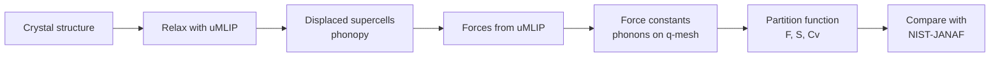
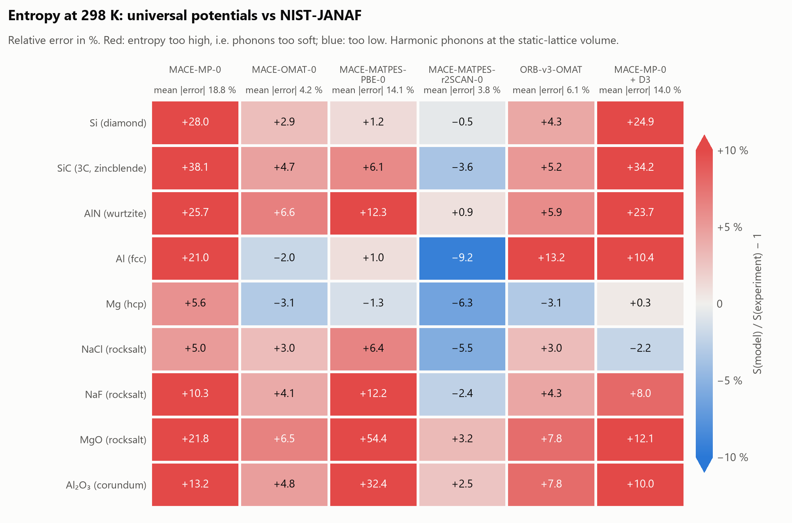
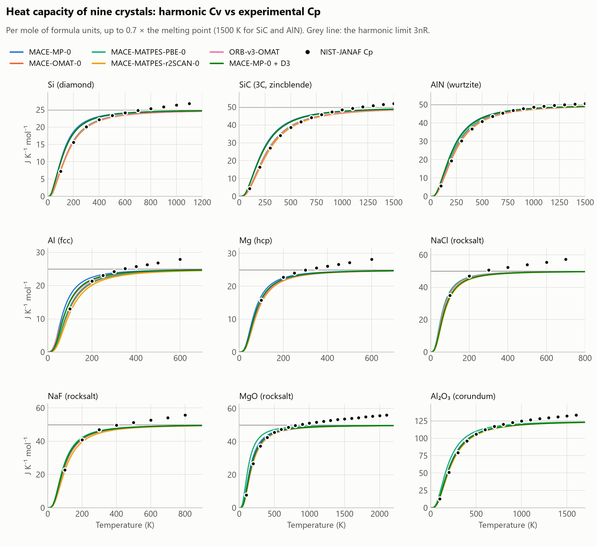
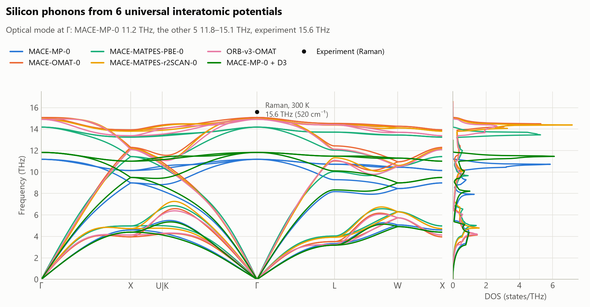
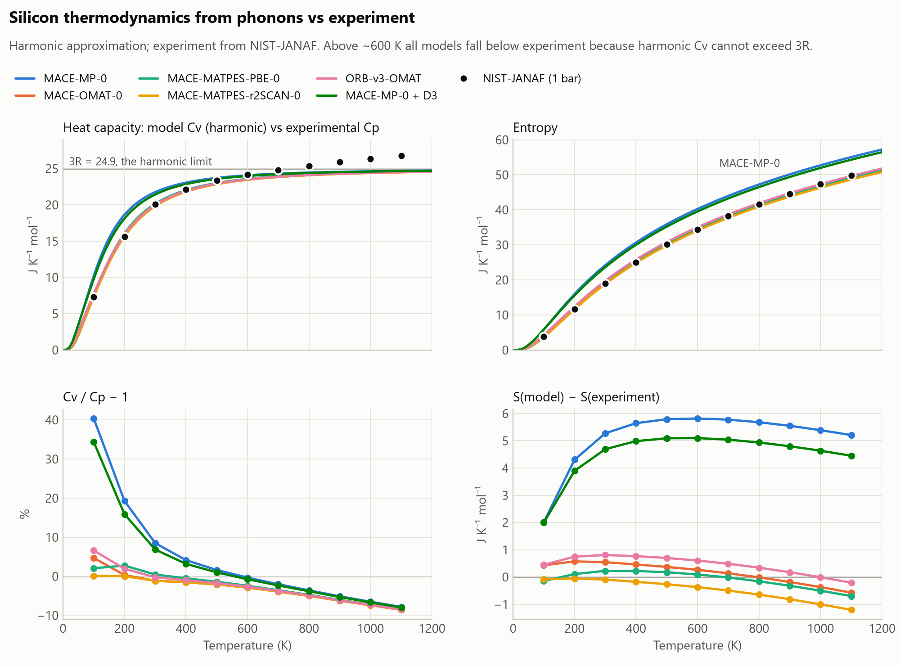

# forces2free-energy

**From forces to free energy: phonon thermodynamics of crystals from universal machine-learning interatomic potentials, benchmarked against experiment**

Universal machine-learning interatomic potentials (uMLIPs) approach the accuracy of density-functional theory (DFT) at a computational cost several orders of magnitude lower, and are increasingly used to predict phonons and thermal properties. Their benchmarks, however, use DFT as the reference (e.g. Matbench Discovery; Loew et al., 2025), so their agreement with experimental thermodynamic data is less well established.

This project computes harmonic phonons with uMLIPs by the finite-displacement method (phonopy), evaluates the vibrational entropy, heat capacity and Helmholtz free energy from the phonon partition function, and compares them with the NIST-JANAF thermochemical tables. The models are chosen as controlled pairs, so that the effects of the training data, the exchange–correlation functional and the model architecture can be separated.

Across nine crystals (covalent, metallic, ionic and oxide), MACE-MP-0 overestimates the entropy at 298 K for every material, by 5–38 %; MACE-OMAT-0 and MACE-MATPES-r2SCAN-0 reproduce it to within about 4 % on average; and MACE-MATPES-PBE-0 fails for MgO (+54 %), for which its energy surface is far too soft.



## Status

- [x] **Stage 1: silicon end to end** with four MACE foundation models, tests, convergence study
- [x] **Stage 2: nine crystals** (covalent, metallic, ionic, oxide) × five potentials, including ORB-v3 as an architecture comparison
- [ ] Stage 3: quasi-harmonic approximation → Cp and thermal expansion
- [ ] Stage 4: α/β-Sn transition temperature and its sensitivity to energy errors
- [ ] Stage 5: report

## Results: nine crystals





| Model | Mean \|S/S<sub>exp</sub> − 1\| at 298 K | Within 5 % | Largest error | Mean \|Cv/Cp − 1\|, 100 K to 0.7 T<sub>m</sub> |
|---|---|---|---|---|
| MACE-MP-0 | 18.8 % | 0 of 9 | SiC, +38.1 % | 7.9 % |
| MACE-OMAT-0 | 4.2 % | 7 of 9 | AlN, +6.6 % | 5.2 % |
| MACE-MATPES-PBE-0 | 14.1 % | 3 of 9 | MgO, +54.4 % | 6.9 % |
| MACE-MATPES-r2SCAN-0 | 3.8 % | 6 of 9 | Al, −9.2 % | 5.4 % |
| ORB-v3-OMAT | 6.1 % | 4 of 9 | Al, +13.2 % | 5.4 % |

T<sub>m</sub>: melting point from the JANAF table; SiC and AlN decompose instead of melting and are compared up to 1500 K. Relaxation and all force evaluations take 1.4–12 s per material for the MACE models and 4–55 s for ORB-v3 on a laptop GPU (NVIDIA RTX 4060).

- **MACE-MP-0 is softened for every material.** Its entropy is too high by 5 % (NaCl) to 38 % (SiC), so the softening found for silicon is systematic across bonding types.
- **Training data.** Replacing MPtrj by OMat24 (MACE-MP-0 → MACE-OMAT-0) reduces the mean error from 18.8 % to 4.2 %.
- **Architecture.** ORB-v3-OMAT, trained on the same OMat24 data with a different architecture, has a mean error of 6.1 %, with its largest deviation for Al (+13.2 %). Unlike MACE, ORB-v3 is not exactly rotation-equivariant: rotating a structure changes its forces by up to 1.8×10⁻³ eV/Å ([dev log](docs/dev-log.md), entry 15). The workflow symmetrizes the force constants; whether the remaining asymmetry contributes to the Al deviation has not been tested.
- **Functional.** MACE-MATPES-r2SCAN-0 has the lowest mean error (3.8 %) but underestimates the entropy of Al (−9.2 %), Mg (−6.3 %) and NaCl (−5.5 %). Part of this is expected from the method: the harmonic calculation at the static-lattice volume leaves out thermal expansion, which lowers the entropy most in soft solids (a rough estimate from (∂S/∂V)<sub>T</sub> = α<sub>V</sub>B gives 2–3 % at 298 K for Al and NaCl), and it leaves out the electronic entropy of metals (about 1.4 % for Al). PBE overestimates lattice constants, which partly offsets the missing expansion, so small errors of PBE-based models for soft solids may be partly fortuitous.
- **A failure: MACE-MATPES-PBE-0 for MgO and Al₂O₃** (+54 % and +32 %). For MgO the model's energy minimum lies at a = 4.165 Å with a bulk modulus of 106 GPa, against 153 GPa from MACE-OMAT-0 and 163 GPa from MACE-MATPES-r2SCAN-0. A scan of the energy against the lattice constant confirms that this is the model's energy surface, not a relaxation problem.
- **Heat capacity of soft solids.** For Al, Mg, NaCl and NaF every model falls below the measured Cp already at 298 K (by 1–7 %) and by 11–14 % at 0.7 T<sub>m</sub>, where the five models differ by little more than 1 %. This is the part of Cp that the harmonic approximation omits (Cp − Cv and anharmonicity), which stage 3 addresses.

Not included: the electronic heat capacity and entropy of the metals, and the LO–TO splitting of polar crystals (the potentials provide no Born effective charges), which affects only a small region of the Brillouin zone near Γ.

## Results: silicon in detail





| Model | a (Å) | Γ optical (THz) | S(298 K) | S − S<sub>exp</sub> | S MAE, 100–1100 K | Mean \|Cv/Cp − 1\|, 100–1100 K |
|---|---|---|---|---|---|---|
| MACE-MP-0 | 5.455 | 11.18 | 24.08 | +5.26 | 5.14 | 9.0 % |
| MACE-OMAT-0 | 5.424 | 15.08 | 19.36 | +0.54 | 0.37 | 3.8 % |
| MACE-MATPES-PBE-0 | 5.448 | 14.18 | 19.04 | +0.22 | 0.24 | 3.3 % |
| MACE-MATPES-r2SCAN-0 | 5.439 | 14.94 | 18.73 | −0.09 | 0.44 | 3.3 % |
| ORB-v3-OMAT | 5.461 | 14.91 | 19.63 | +0.81 | 0.51 | 3.7 % |
| Experiment | 5.431 | 15.6 (Raman) | 18.82 | | | |

a: relaxed lattice constant (experiment at room temperature). Γ optical: optical phonon frequency at the Γ point. Entropies in J K⁻¹ mol⁻¹. The relaxation and all force evaluations for the phonons take 2–8 s per model.

- **MACE-MP-0 shows strong phonon softening.** Its Γ-point optical frequency is 28 % below experiment, which raises the low-temperature heat capacity (+40 % at 100 K) and the entropy. An independent frozen-phonon calculation based on total energies alone, without phonopy, gives the same frequency (11.2 THz), which rules out an error in the workflow. The result is consistent with the systematic softening reported by Deng et al. (2025).
- **Of the factors tested, the training data have the largest effect.** Within the same architecture family and functional, replacing MPtrj (MACE-MP-0) by OMat24 (MACE-OMAT-0) reduces the entropy error at 298 K from 5.3 to 0.5 J K⁻¹ mol⁻¹.
- **The exchange–correlation functional causes a smaller, systematic shift.** The two MatPES models are fine-tuned from the same checkpoint on MatPES structures computed with PBE and with r2SCAN. The r2SCAN model gives stiffer phonons and an entropy lower by about 0.3 J K⁻¹ mol⁻¹.
- **Above about 600 K all models underestimate the heat capacity by nearly the same amount.** The harmonic Cv is bounded by 3R, whereas the measured Cp continues to rise. An estimate from the measured thermal expansion gives Cp − Cv = α²BVT below 1 % for silicon, so most of the deviation is attributed to anharmonicity; it reflects the harmonic approximation rather than the potentials. Stage 3 adds the quasi-harmonic (thermal-expansion) contribution, which is small for Si but about 10 % for soft or ionic solids at high temperature; the remaining difference is a measure of anharmonicity.

## Validation

| Check | Location |
|---|---|
| Einstein values at x = 1, T → 0 and Dulong–Petit limits | `tests/test_thermo.py` |
| U = F + TS, S = −∂F/∂T and Cv = ∂U/∂T by finite differences | `tests/test_thermo.py` |
| Partition-function implementation vs phonopy: agreement to 1e-10 with phonopy's CODATA 2006 constants, to a few 1e-6 with the exact SI 2019 constants | `tests/test_phonopy_consistency.py` |
| Unit convention: per mole of primitive cells (phonopy) vs per mole of formula units (this project), tested on hcp Cu (Z = 2) | `tests/test_phonopy_consistency.py` |
| Space group, atom count and formula units of all nine starting structures | `tests/test_materials.py` |
| Γ-point optical frequency: frozen-phonon energy fit vs phonopy | `tests/test_mlip_si.py` |
| Supercell (8 → 512 atoms) and q-mesh (8³ → 40³) convergence for Si; supercell convergence for Al, NaCl and Al₂O₃ (S(298 K) within 0.03 J K⁻¹ mol⁻¹ of supercells about twice as large) | `scripts/convergence.py` |

The fast tests use ASE's EMT potential and need no GPU (`uv run pytest`); the tests that download and run a MACE model are selected with `uv run pytest -m mlip`. None of the 45 model–material runs has an imaginary mode.

## Usage

Requires [uv](https://docs.astral.sh/uv/). `uv.lock` pins all package versions, including the CUDA 12.6 build of PyTorch.

```bash
uv sync                                                  # Python 3.12 environment
uv run pytest                                            # fast tests
uv run python scripts/run_all.py                         # all models x all materials in configs/
uv run python scripts/convergence.py --model mace-omat-0 --material NaCl --supercells 2x2x2 3x3x3 4x4x4
uv run python scripts/make_figures.py
```

Outputs are written to `results/<model>/<material>/`: the relaxed structure, `phonopy_params.yaml` (displacements and forces), `thermal_properties.csv`, `comparison_janaf.csv` and `summary.json`.

## Models

| Model | Training data | Functional | License |
|---|---|---|---|
| MACE-MP-0 (medium) | MPtrj, ~1.6 M structures | PBE/PBE+U | MIT |
| MACE-OMAT-0 (medium) | OMat24, ~100 M structures | PBE/PBE+U | ASL (academic) |
| MACE-MATPES-PBE-0 | MACE-OMAT-0 fine-tuned on MatPES-PBE | PBE | ASL (academic) |
| MACE-MATPES-r2SCAN-0 | MACE-OMAT-0 fine-tuned on MatPES-r2SCAN | r2SCAN | ASL (academic) |
| ORB-v3-OMAT (conservative, unlimited neighbours) | OMat24 | PBE/PBE+U | Apache-2.0 |

The models form controlled pairs: MACE-MP-0 and MACE-OMAT-0 differ mainly in the training data, the two MatPES models mainly in the DFT functional, and MACE-OMAT-0 and ORB-v3-OMAT mainly in the architecture. Models whose dependencies conflict with MACE (MatterSim and SevenNet require e3nn ≥ 0.5, MACE pins 0.4.4) will run the `compute` step in a separate environment and pass on `phonopy_params.yaml`.

## Layout

```
configs/        materials.yaml, models.yaml
src/forces2free/
  thermo.py     harmonic partition function -> F, U, S, Cv (derivation: docs/derivation.md)
  phonons.py    phonopy finite displacements with an ASE calculator
  relax.py      symmetry-preserving relaxation of positions and cell
  janaf.py      NIST-JANAF download and parser
  pipeline.py   compute / analyze steps for one (model, material) pair
  models.py     uMLIPs as ASE calculators (float64)
  plotting.py   shared figure style (colour-vision-checked palette)
scripts/        run_all.py, convergence.py, make_figures.py
results/        <model>/<material>/ outputs
tests/          physics and consistency tests
docs/           derivation.md, dev-log.md (problems found during development and how they were caught)
CONTRIBUTING.md development conventions: units, numerics, testing rules
```

## Data and references

- Experiment: M. W. Chase Jr., *NIST-JANAF Thermochemical Tables*, 4th ed., J. Phys. Chem. Ref. Data Monograph 9 (1998), <https://janaf.nist.gov> (downloaded on first use, not redistributed here).
- Phonons: A. Togo, *phonopy*, <https://github.com/phonopy/phonopy>.
- MACE foundation models: <https://github.com/ACEsuit/mace-foundations>; MatPES: Kaplan et al., 2025.
- ORB-v3: <https://github.com/orbital-materials/orb-models>.
- A. Loew et al., *Universal machine learning interatomic potentials are ready for phonons*, npj Comput. Mater. 11, 178 (2025), doi:10.1038/s41524-025-01650-1.
- B. Deng et al., *Systematic softening in universal machine learning interatomic potentials*, npj Comput. Mater. (2025), doi:10.1038/s41524-024-01500-6.
